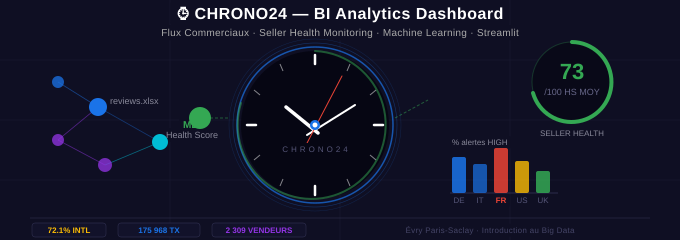

<!-- BANNER -->

  

<h1 align="center">⌚ Chrono24 — BI Analytics Dashboard</h1>

  <strong>Analyse des flux commerciaux internationaux & Monitoring de la santé des vendeurs</strong> 
  <em>Introduction au Big Data · Université d'Évry Paris-Saclay</em>

  
  
  
  
  

---

## 🎯 Présentation du projet

Ce projet de **Business Intelligence** a été réalisé dans le cadre du cours d'**Introduction au Big Data** à l'Université d'Évry Paris-Saclay. Il s'articule autour de deux axes analytiques complémentaires appliqués aux données de **Chrono24**, leader mondial de la vente de montres de luxe en ligne.

> **Question centrale :** *Quels flux commerciaux internationaux dominent sur Chrono24, et ces flux influencent-ils la satisfaction des clients ? Comment détecter de manière précoce les vendeurs dont la performance se dégrade ?*

---

## 📊 Périmètre des données

| Indicateur | Valeur |
|---|---|
| 📦 Transactions analysées | **175 968** |
| 🏪 Vendeurs monitorés | **2 309** |
| 🌍 Pays acheteurs | **67** |
| 🗓️ Période | **2016 — 2020** |
| 📅 Snapshot Seller Health | **17 Avril 2020** |

---

##  Architecture du projet

chrono24_app/
├── app.py                   # Entry point · navigation · routing
├── config.py                # Thème dark · palette · template Plotly
├── requirements.txt
├── data/
│   ├── loader.py            # @st.cache_data · lecture xlsx
│   ├── processor.py         # Feature engineering · agrégations
│   ├── chrono24_dashboard.xlsx
│   └── Chrono24_SellerHealth_PowerBI_Model.xlsx
├── modules/
│   ├── p1_vue_globale.py    # KPIs + storytelling
│   ├── p2_flux.py           # Heatmap + bar chart flux
│   ├── p3_satisfaction.py   # Comparaisons multi-critères
│   ├── p4_evolution.py      # Dual-axis timeline
│   ├── p5_marques.py        # Treemap + bubble chart
│   ├── p6_portfolio.py      # Seller Health overview
│   ├── p7_risk_map.py       # Choropleth + risk map
│   └── p8_drill_down.py     # Radar chart + fiche vendeur
└── components/
└── kpi_cards.py         # Composants UI réutilisables
