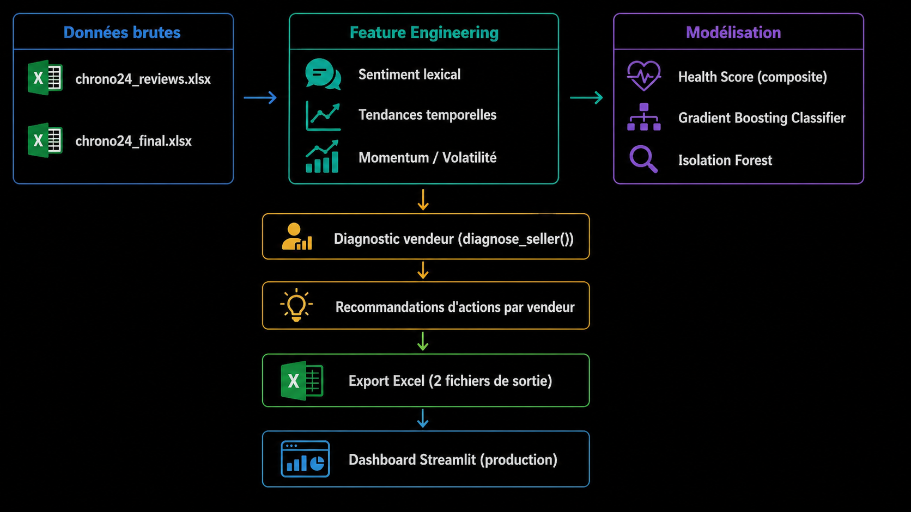

<!-- BANNER -->
<p align="center">
  
</p>

<h1 align="center">⌚ Chrono24 — BI Analytics Dashboard</h1>

<p align="center">
  <strong>Analyse des flux commerciaux internationaux & Monitoring de la santé des vendeurs</strong><br/>
  <em>Introduction au Big Data · Université d'Évry Paris-Saclay</em>
</p>

<p align="center">
  <a href="https://chrono24-dashboard-bosky.streamlit.app/">
    
  </a>
  
  
  
  
</p>

---

## 🎯 Présentation du projet


Ce projet de **Business Intelligence** a été réalisé dans le cadre du cours d'**Introduction au Big Data** à l'Université d'Évry Paris-Saclay. Il s'articule autour de deux axes analytiques complémentaires appliqués aux données de **Chrono24**, leader mondial de la vente de montres de luxe en ligne.

> **Question centrale :** *Quels flux commerciaux internationaux dominent sur Chrono24, et ces flux influencent-ils la satisfaction des clients ? Comment détecter de manière précoce les vendeurs dont la performance se dégrade ?*

---

## 📊 Périmètre des données

| Indicateur | Valeur |
|---|---|
| 📦 Transactions analysées | **175 968** |
| 🏪 Vendeurs monitorés | **2 309** |
| 🌍 Pays acheteurs | **67** |
| 🗓️ Période | **2016 — 2020** |
| 📅 Snapshot Seller Health | **17 Avril 2020** |

---

##  Architecture du projet

```
chrono24_app/
├── app.py                   # Entry point · navigation · routing
├── config.py                # Theme dark · palette · template Plotly
├── requirements.txt
├── data/
│   ├── loader.py            # @st.cache_data · lecture xlsx
│   ├── processor.py         # Feature engineering · agregations
│   ├── chrono24_dashboard.xlsx
│   └── Chrono24_SellerHealth_PowerBI_Model.xlsx
├── modules/
│   ├── p1_vue_globale.py    # KPIs + storytelling
│   ├── p2_flux.py           # Heatmap + bar chart flux
│   ├── p3_satisfaction.py   # Comparaisons multi-criteres
│   ├── p4_evolution.py      # Dual-axis timeline
│   ├── p5_marques.py        # Treemap + bubble chart
│   ├── p6_portfolio.py      # Seller Health overview
│   ├── p7_risk_map.py       # Choropleth + risk map
│   └── p8_drill_down.py     # Radar chart + fiche vendeur
└── components/
    └── kpi_cards.py         # Composants UI reutilisables
```
---

##  Pipeline CRISP-DM



### 🧮 Formule du Health Score

```python
Health Score = (
    c_rating   × 0.30   # Note snapshot normalisée
  + c_trend    × 0.20   # Tendance sentiment 3 mois
  + c_sent     × 0.15   # Niveau sentiment 6 mois
  + c_recency  × 0.15   # Récence des avis négatifs
  + c_vol      × 0.10   # Stabilité (inverse volatilité)
  + c_momentum × 0.10   # Momentum 30j vs 12m
) × 100
```

| Catégorie | Seuil | Action |
|---|---|---|
| 🟢 Sain | HS ≥ 72 | Surveillance standard |
| 🟡 À surveiller | 55 ≤ HS < 72 | Monitoring renforcé |
| 🔴 En danger | HS < 55 | Intervention requise |

---

## 📱 Les 8 pages du dashboard

### Module 1 — Flux Commerciaux

| Page | Description | Visuels |
|---|---|---|
| P1 · Vue Globale | KPIs macro + storytelling | Donut · courbe satisfaction · bar chart |
| P2 · Cartographie des Flux | Routes commerciales dominantes | Heatmap 12×12 · bar chart horizontal |
| P3 · Impact Satisfaction | Domestique vs Intl vs EU vs Intercontinental | Grouped bar · radar · lollipop |
| P4 · Évolution Temporelle | Trajectoire 2016–2020 + impact Covid | Dual-axis · area chart |
| P5 · Analyse par Marque | Concentration du marché horloger | Treemap · bubble chart 3 dimensions |

### Module 2 — Seller Health

| Page | Description | Visuels |
|---|---|---|
| P6 · Portfolio Overview | Vue d'ensemble des 2 309 vendeurs | Histogramme · donut · scatter |
| P7 · Risk Map par Pays | Concentration géographique du risque | Choropleth · bar chart · scatter |
| P8 · Drill-down Vendeur | Profil individuel + diagnostic ML | Radar chart · barre HS · métriques |

---

## 🚀 Lancer l'application en local

```bash
# Cloner le repository
git clone git@github.com:Kone320/chrono24-dashboard.git
cd chrono24-dashboard

# Installer les dépendances
pip install -r requirements.txt

# Lancer l'application
streamlit run app.py
```

---

## 🌐 Application déployée

👉 **https://chrono24-dashboard-bosky.streamlit.app/**

---

## 🛠️ Stack technique

| Technologie | Usage |
|---|---|
| `streamlit` | Interface web et déploiement cloud |
| `plotly` | Visualisations interactives |
| `pandas` | Traitement et agrégation des données |
| `scikit-learn` | Gradient Boosting · Isolation Forest |
| `numpy` | Calculs numériques et normalisation |
| `openpyxl` | Lecture des fichiers Excel |
| `matplotlib` | Support des dégradés de couleur |


---

## 🏫 Contexte académique

Projet réalisé dans le cadre du cours d'**Introduction au Big Data**  
**Université d'Évry Paris-Saclay** · 2025–2026


---

*Made with ❤️ · Data Science · Big Data · Machine Learning*
